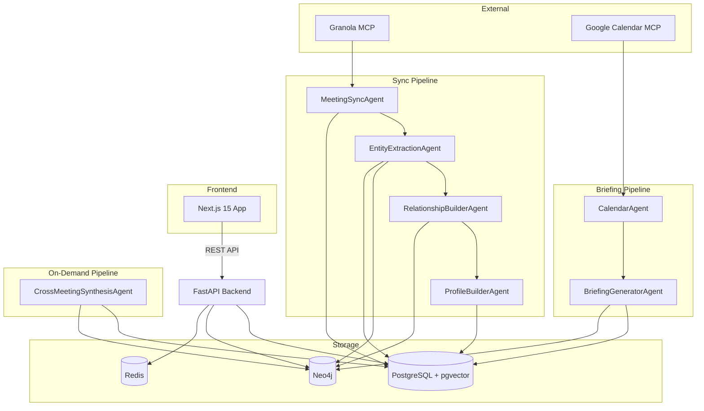
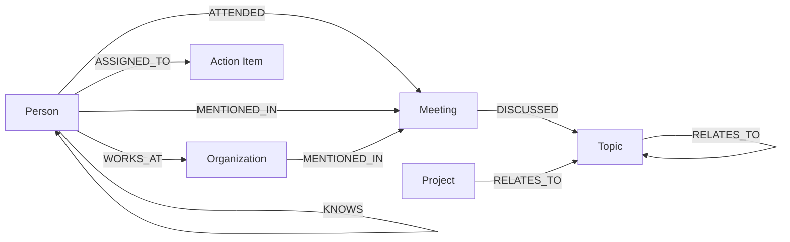
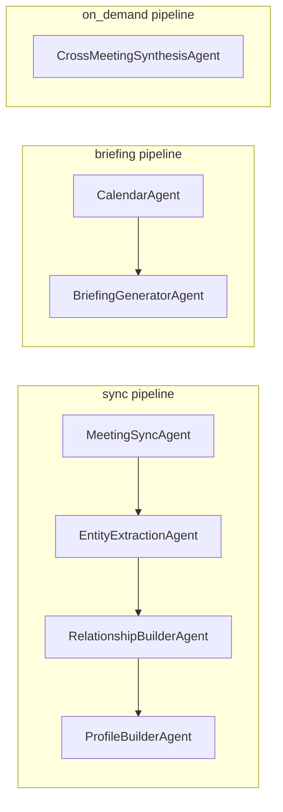
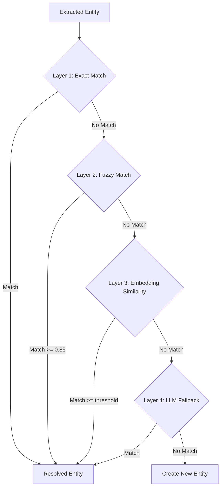
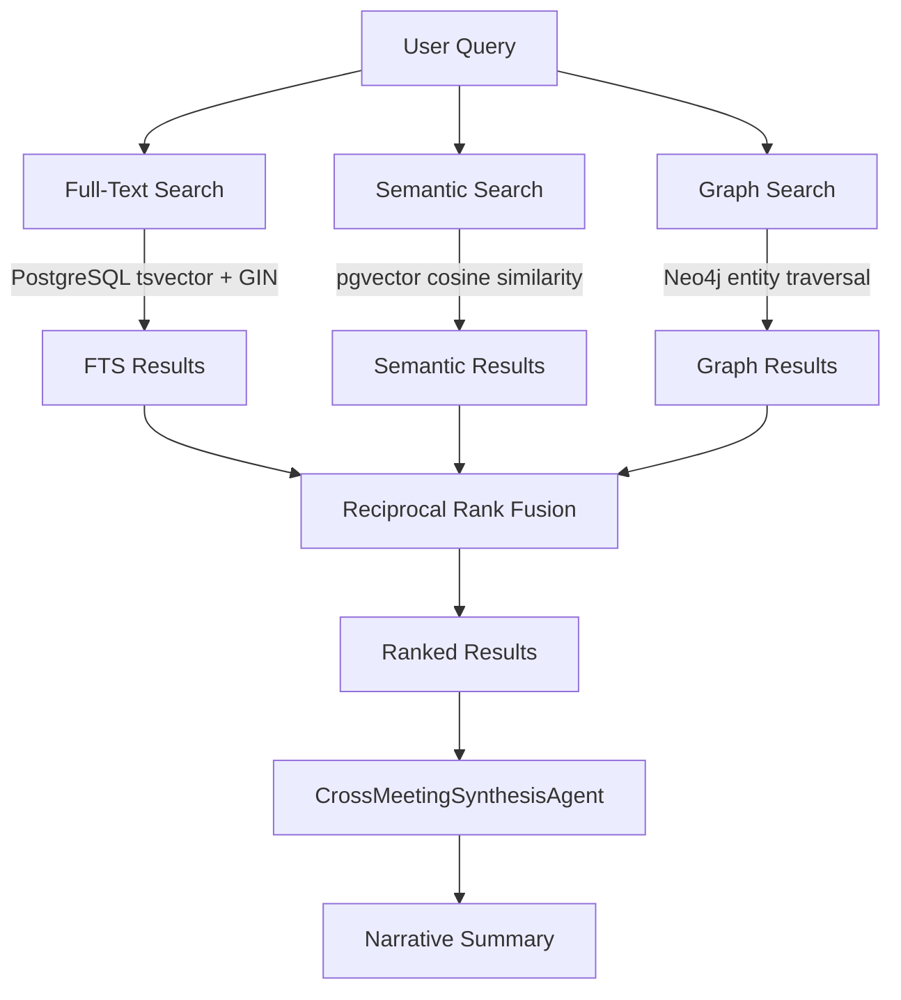
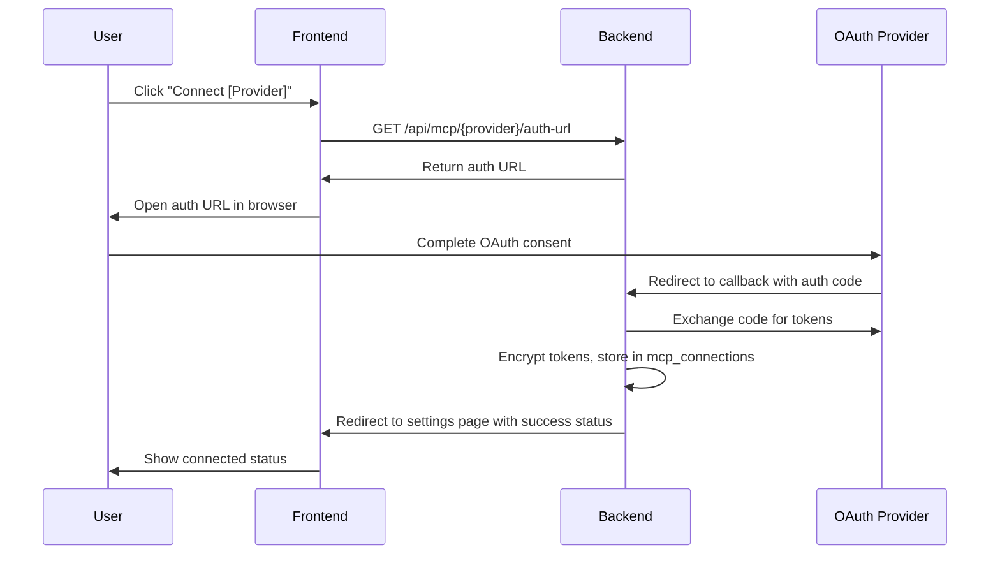
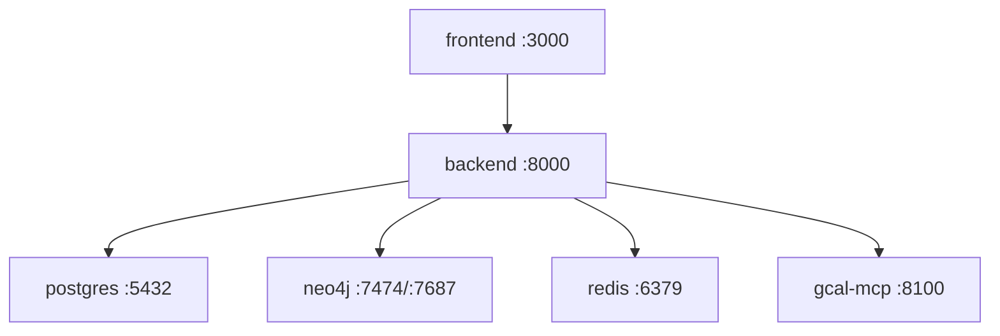

# Personal Meeting Assistant -- Architecture Reference

## Table of Contents

1. [Overview](#1-overview)
2. [Tech Stack](#2-tech-stack)
3. [Project Structure](#3-project-structure)
4. [Data Models](#4-data-models)
5. [Extensibility Architecture](#5-extensibility-architecture)
6. [AgentState Schema](#6-agentstate-schema)
7. [AI Agents](#7-ai-agents)
8. [Entity Resolution Strategy](#8-entity-resolution-strategy)
9. [Search Architecture](#9-search-architecture-hybrid-3-layer)
10. [MCP Integration](#10-mcp-integration)
11. [OAuth Flow for Docker](#11-oauth-flow-for-docker)
12. [Cost Control and Rate Limiting](#12-cost-control-and-rate-limiting)
13. [Graceful Degradation](#13-graceful-degradation)
14. [Agent Observability](#14-agent-observability)
15. [Processing State and Idempotency](#15-processing-state-and-idempotency)
16. [Redis Usage](#16-redis-usage)
17. [Docker Compose Services](#17-docker-compose-services)

---

## 1. Overview

The Personal Meeting Assistant is a multi-AI-agent system that automates the lifecycle of meeting intelligence. It syncs meetings from [Granola](https://granola.ai) via MCP, integrates with Google Calendar via MCP, extracts entities and relationships using AI, builds a persistent knowledge graph, generates pre-meeting briefings, and provides cross-meeting search and synthesis.

The system is organized around three pipelines -- **sync**, **briefing**, and **on-demand** -- each composed of purpose-built AI agents coordinated by LangGraph. Two MCP providers supply external data (Granola for meeting content, Google Calendar for scheduling context), while PostgreSQL and Neo4j serve as the dual persistence layer for structured data, vector embeddings, and graph relationships.



---

## 2. Tech Stack

| Layer | Technology | Purpose |
|-------|-----------|---------|
| **Frontend** | Next.js 15 (App Router) | Server/client rendering, routing |
| | TypeScript | Type safety |
| | Tailwind CSS | Utility-first styling |
| | shadcn/ui | Component library |
| | React Flow | Knowledge graph visualization |
| | TanStack Query | Server state management, caching |
| **Backend** | Python 3.12 | Runtime |
| | FastAPI | Async REST API |
| | LangGraph | Agent orchestration, pipeline graphs |
| | OpenAI GPT-4o | LLM for extraction, synthesis, briefings |
| | langchain-mcp-adapters | MCP tool integration into LangChain |
| **Databases** | PostgreSQL 16 + pgvector | Meetings, profiles, embeddings, full-text search |
| | Neo4j 5 | Entity relationships, graph traversal |
| **Infrastructure** | Docker Compose | Multi-service orchestration (6 services) |
| | Redis 7 | Caching, distributed sync lock, LangGraph checkpointer |

---

## 3. Project Structure

```
personal-meeting-assistant/
├── docker-compose.yml
├── .env.example
├── frontend/                          # Next.js 15 application
│   ├── package.json
│   ├── next.config.ts
│   ├── tailwind.config.ts
│   ├── tsconfig.json
│   └── src/
│       ├── app/                       # App Router pages
│       │   ├── layout.tsx
│       │   ├── page.tsx               # Dashboard
│       │   ├── dashboard/
│       │   ├── meetings/
│       │   │   ├── page.tsx           # Meeting list
│       │   │   └── [id]/page.tsx      # Meeting detail
│       │   ├── relationships/         # Knowledge graph view
│       │   ├── profiles/              # People/org profiles
│       │   ├── calendar/              # Calendar integration
│       │   ├── action-items/          # Action item tracker
│       │   ├── briefings/             # Pre-meeting briefings
│       │   ├── agents/                # Agent activity monitor
│       │   └── settings/              # MCP connections, config
│       ├── components/
│       │   ├── ui/                    # shadcn/ui primitives
│       │   ├── layout/               # Shell, sidebar, nav
│       │   ├── meetings/             # Meeting cards, detail panels
│       │   ├── relationships/        # React Flow graph components
│       │   ├── profiles/             # Profile cards, edit forms
│       │   ├── agents/               # Agent status, run log table
│       │   └── calendar/             # Calendar widgets
│       └── lib/
│           ├── api-client.ts          # Typed fetch wrapper
│           ├── hooks/                 # TanStack Query hooks
│           └── types.ts              # Shared TypeScript types
├── backend/                           # Python FastAPI application
│   ├── requirements.txt
│   ├── Dockerfile
│   └── app/
│       ├── main.py                    # FastAPI app entry point
│       ├── config.py                  # Settings via pydantic-settings
│       ├── api/
│       │   ├── routes/                # REST endpoint modules
│       │   │   ├── meetings.py
│       │   │   ├── search.py
│       │   │   ├── profiles.py
│       │   │   ├── relationships.py
│       │   │   ├── calendar.py
│       │   │   ├── briefings.py
│       │   │   ├── agents.py
│       │   │   ├── action_items.py
│       │   │   └── mcp.py
│       │   └── schemas/               # Pydantic request/response models
│       ├── agents/
│       │   ├── base.py                # BaseAgent abstract class
│       │   ├── registry.py            # AgentRegistry + graph builder
│       │   ├── meeting_sync.py
│       │   ├── entity_extraction.py
│       │   ├── relationship_builder.py
│       │   ├── profile_builder.py
│       │   ├── calendar_agent.py
│       │   ├── briefing_generator.py
│       │   └── cross_meeting_synthesis.py
│       ├── mcp/
│       │   ├── base.py                # BaseMCPProvider abstract class
│       │   ├── registry.py            # MCPRegistry + auto-discovery
│       │   └── providers/
│       │       ├── granola.py
│       │       └── google_calendar.py
│       ├── models/                    # SQLAlchemy ORM models
│       │   ├── meeting.py
│       │   ├── transcript_chunk.py
│       │   ├── attendee.py
│       │   ├── action_item.py
│       │   ├── profile.py
│       │   ├── mcp_connection.py
│       │   ├── briefing.py
│       │   ├── meeting_processing_status.py
│       │   └── agent_run_log.py
│       ├── services/
│       │   ├── meeting_service.py
│       │   ├── search_service.py
│       │   ├── transcript_service.py
│       │   ├── neo4j_service.py
│       │   ├── embedding_service.py
│       │   └── scheduler_service.py
│       └── db/
│           ├── postgres.py            # Async SQLAlchemy engine/session
│           └── neo4j_driver.py        # Async Neo4j driver setup
├── docs/
│   └── ARCHITECTURE.md                # This file
└── .cursor/
    └── rules/                         # 6 Cursor rule files
        ├── backend.mdc
        ├── frontend.mdc
        ├── agents.mdc
        ├── mcp.mdc
        ├── database.mdc
        └── general.mdc
```

---

## 4. Data Models

### PostgreSQL Tables

#### `meetings`

| Column | Type | Notes |
|--------|------|-------|
| `id` | `UUID` | Primary key |
| `granola_id` | `TEXT UNIQUE` | Identifier from Granola |
| `title` | `TEXT` | Meeting title |
| `date` | `TIMESTAMPTZ` | Meeting date/time |
| `duration` | `INTEGER` | Duration in minutes |
| `raw_notes` | `TEXT` | Unprocessed notes from Granola |
| `enhanced_notes` | `TEXT` | AI-enhanced notes |
| `summary` | `TEXT` | Generated summary |
| `search_vector` | `TSVECTOR` | Full-text search index (GIN-indexed) |
| `embedding` | `VECTOR(1536)` | pgvector embedding for semantic search |
| `synced_at` | `TIMESTAMPTZ` | Last sync timestamp |

#### `transcript_chunks`

| Column | Type | Notes |
|--------|------|-------|
| `id` | `UUID` | Primary key |
| `meeting_id` | `UUID FK` | References `meetings.id` |
| `chunk_index` | `INTEGER` | Ordering within transcript |
| `speaker` | `TEXT` | Speaker name |
| `content` | `TEXT` | Chunk text |
| `start_time` | `FLOAT` | Start offset in seconds |
| `end_time` | `FLOAT` | End offset in seconds |
| `search_vector` | `TSVECTOR` | Full-text search index |
| `embedding` | `VECTOR(1536)` | pgvector embedding |

#### `attendees`

| Column | Type | Notes |
|--------|------|-------|
| `id` | `UUID` | Primary key |
| `meeting_id` | `UUID FK` | References `meetings.id` |
| `name` | `TEXT` | Attendee name |
| `email` | `TEXT` | Attendee email |
| `role` | `TEXT` | Role in meeting (organizer, attendee, etc.) |

#### `action_items`

| Column | Type | Notes |
|--------|------|-------|
| `id` | `UUID` | Primary key |
| `meeting_id` | `UUID FK` | References `meetings.id` |
| `assignee` | `TEXT` | Person responsible |
| `description` | `TEXT` | Action item description |
| `status` | `TEXT` | One of: `open`, `done`, `dismissed` |
| `due_date` | `DATE` | Optional due date |
| `created_at` | `TIMESTAMPTZ` | Extraction timestamp |

#### `profiles`

| Column | Type | Notes |
|--------|------|-------|
| `id` | `UUID` | Primary key |
| `type` | `TEXT` | One of: `self`, `contact`, `org` |
| `name` | `TEXT` | Display name |
| `email` | `TEXT` | Primary email |
| `bio` | `TEXT` | Generated biography |
| `notes` | `TEXT` | User-editable notes |
| `traits` | `JSONB` | Extracted personality traits, preferences |
| `learning_log` | `JSONB` | Progressive learning entries |
| `embedding` | `VECTOR(1536)` | Profile embedding |

#### `mcp_connections`

| Column | Type | Notes |
|--------|------|-------|
| `id` | `UUID` | Primary key |
| `provider` | `TEXT UNIQUE` | Provider name (e.g., `granola`, `google_calendar`) |
| `status` | `TEXT` | Connection status |
| `oauth_tokens` | `TEXT` | Encrypted OAuth token JSON |
| `config` | `JSONB` | Provider-specific configuration |
| `last_sync` | `TIMESTAMPTZ` | Last successful sync |
| `last_error` | `TEXT` | Most recent error message |

#### `briefings`

| Column | Type | Notes |
|--------|------|-------|
| `id` | `UUID` | Primary key |
| `meeting_id` | `UUID FK` | References `meetings.id` |
| `content` | `TEXT` | Generated briefing content |
| `topics` | `JSONB` | Extracted topic list |
| `generated_at` | `TIMESTAMPTZ` | Generation timestamp |

#### `meeting_processing_status`

| Column | Type | Notes |
|--------|------|-------|
| `id` | `UUID` | Primary key |
| `meeting_id` | `UUID FK` | References `meetings.id` |
| `agent_name` | `TEXT` | Name of the processing agent |
| `status` | `TEXT` | One of: `pending`, `processing`, `completed`, `failed` |
| `error_message` | `TEXT` | Error details on failure |
| `retry_count` | `INTEGER` | Number of retry attempts |
| `started_at` | `TIMESTAMPTZ` | Processing start time |
| `completed_at` | `TIMESTAMPTZ` | Processing completion time |

#### `agent_run_log`

| Column | Type | Notes |
|--------|------|-------|
| `id` | `UUID` | Primary key |
| `pipeline` | `TEXT` | Pipeline name (`sync`, `briefing`, `on_demand`) |
| `agent_name` | `TEXT` | Agent that executed |
| `trigger` | `TEXT` | What triggered the run |
| `status` | `TEXT` | Run outcome |
| `meetings_processed` | `INTEGER` | Count of meetings processed |
| `entities_extracted` | `INTEGER` | Count of entities extracted |
| `errors_count` | `INTEGER` | Count of errors encountered |
| `tokens_used` | `INTEGER` | Total LLM tokens consumed |
| `duration_ms` | `INTEGER` | Wall-clock duration in milliseconds |
| `started_at` | `TIMESTAMPTZ` | Run start time |
| `completed_at` | `TIMESTAMPTZ` | Run completion time |

### Neo4j Graph Schema



**Node Labels:**

| Label | Key Properties |
|-------|---------------|
| `Person` | `entity_id`, `name`, `email`, `type` (self/contact) |
| `Organization` | `entity_id`, `name`, `domain` |
| `Topic` | `entity_id`, `name`, `category` |
| `Project` | `entity_id`, `name`, `status` |
| `Meeting` | `meeting_id`, `title`, `date` |

**Relationship Types:**

| Relationship | Source | Target | Properties |
|-------------|--------|--------|------------|
| `ATTENDED` | Person | Meeting | `role` |
| `DISCUSSED` | Meeting | Topic | `relevance_score` |
| `WORKS_AT` | Person | Organization | `role`, `since` |
| `KNOWS` | Person | Person | `strength`, `context`, `first_seen`, `last_seen` |
| `ASSIGNED_TO` | Person | Action Item | `status`, `due_date` |
| `RELATES_TO` | Topic/Project | Topic/Project | `weight` |
| `MENTIONED_IN` | Person/Organization | Meeting | `count` |

---

## 5. Extensibility Architecture

### MCP Provider Registry

The MCP layer abstracts external tool providers behind a common interface. Each provider is a self-contained module that handles authentication, tool discovery, and tool execution.

```python
class BaseMCPProvider(ABC):
    name: str
    description: str
    auth_type: Literal["oauth2", "api_key", "none"]

    @abstractmethod
    async def connect(self, credentials: dict) -> None: ...

    @abstractmethod
    async def disconnect(self) -> None: ...

    @abstractmethod
    async def list_tools(self) -> list[MCPTool]: ...

    @abstractmethod
    async def execute_tool(self, tool_name: str, params: dict) -> Any: ...

    @abstractmethod
    async def health_check(self) -> HealthStatus: ...
```

**MCPRegistry** manages provider lifecycle:

| Method | Description |
|--------|-------------|
| `register(provider)` | Register a provider instance |
| `get(name)` | Retrieve a provider by name |
| `list_all()` | List all registered providers |
| `auto_discover()` | Scan `mcp/providers/` directory and register all found providers |

**Adding a new MCP provider:** Create a single file in `mcp/providers/` implementing `BaseMCPProvider`, then add the provider's configuration to `.env`. The registry auto-discovers it on startup.

### Agent Registry

The agent layer uses a registry pattern combined with LangGraph for orchestration. Agents declare their pipeline membership and inter-agent dependencies, and the registry builds executable graphs from those declarations.

```python
class BaseAgent(ABC):
    name: str
    description: str
    pipeline: Literal["sync", "briefing", "on_demand"]
    dependencies: list[str]        # Names of agents that must run before this one
    required_mcp_providers: list[str]

    @abstractmethod
    async def process(self, state: AgentState) -> AgentState: ...

    def should_run(self, state: AgentState) -> bool: ...
```

**AgentRegistry** manages agent lifecycle and graph construction:

| Method | Description |
|--------|-------------|
| `register(agent)` | Register an agent instance |
| `get(name)` | Retrieve an agent by name |
| `build_graph(pipeline_name)` | Build a LangGraph `StateGraph` from agents in the named pipeline, respecting declared dependencies |
| `resolve_dependencies()` | Topologically sort agents within each pipeline |

**Pipeline Composition:**



**Adding a new agent:** Create a single file in `agents/` implementing `BaseAgent` with the correct `pipeline` and `dependencies` declared. The registry auto-discovers it and slots it into the appropriate graph.

---

## 6. AgentState Schema

All agents within a pipeline share a single `AgentState` typed dictionary. Each agent reads from and writes to specific keys, enabling loose coupling while maintaining a well-defined contract.

```python
class AgentState(TypedDict):
    # Trigger context
    trigger: str                    # "scheduled_sync" | "manual_sync" | "pre_meeting" | "search"
    trigger_params: dict            # Additional parameters (e.g., search query, meeting ID)

    # Sync results
    new_meeting_ids: list[str]
    updated_meeting_ids: list[str]
    skipped_meeting_ids: list[str]

    # Extraction results
    extracted_entities: list[dict]
    resolved_entities: list[dict]
    extracted_action_items: list[dict]

    # Graph results
    new_relationships: list[dict]
    updated_relationships: list[dict]

    # Briefing context
    upcoming_meetings: list[dict]
    briefing: dict | None

    # Search/synthesis results
    search_results: list[dict]
    synthesis: str | None

    # Error tracking
    errors: list[dict]

    # Shared infrastructure (injected at pipeline start)
    mcp_registry: MCPRegistry
    db_session: AsyncSession
    neo4j_driver: AsyncDriver
```

**Key design decisions:**

- **Flat structure:** Every agent reads/writes top-level keys. No nesting avoids deep coupling.
- **Additive writes:** Agents append to lists rather than overwriting, so downstream agents see the full accumulated state.
- **Error accumulation:** The `errors` list collects non-fatal errors from any agent. The pipeline runner inspects this after completion to determine partial success.
- **Infrastructure injection:** `mcp_registry`, `db_session`, and `neo4j_driver` are injected once at pipeline start and passed through unchanged.

---

## 7. AI Agents

### 7.1 MeetingSyncAgent

| Property | Value |
|----------|-------|
| Pipeline | `sync` |
| Dependencies | None (first in pipeline) |
| MCP Providers | `granola` |

**Responsibilities:**
1. Calls Granola MCP tools (`list_meetings`, `get_meeting_transcript`) via `langchain-mcp-adapters`
2. Diffs fetched meetings against PostgreSQL by `granola_id` to identify new and updated meetings
3. Upserts meeting records in the `meetings` table
4. Chunks transcripts into the `transcript_chunks` table (if transcript available)
5. Generates OpenAI embeddings for both meetings and chunks, stored via pgvector
6. Builds `tsvector` search indexes for full-text search
7. Populates `new_meeting_ids`, `updated_meeting_ids`, and `skipped_meeting_ids` in state

### 7.2 EntityExtractionAgent

| Property | Value |
|----------|-------|
| Pipeline | `sync` |
| Dependencies | `MeetingSyncAgent` |
| MCP Providers | None |

**Responsibilities:**
1. Reads new/updated meetings from state
2. Uses GPT-4o with structured outputs (JSON mode) for named entity recognition: people, organizations, topics, projects
3. Extracts action items with assignee, description, and due date
4. Stores extracted entities as Neo4j nodes (creating or merging via entity resolution)
5. Stores action items in the `action_items` PostgreSQL table
6. Populates `extracted_entities`, `resolved_entities`, and `extracted_action_items` in state

### 7.3 RelationshipBuilderAgent

| Property | Value |
|----------|-------|
| Pipeline | `sync` |
| Dependencies | `EntityExtractionAgent` |
| MCP Providers | None |

**Responsibilities:**
1. Performs co-occurrence analysis across resolved entities within and across meetings
2. Creates new Neo4j edges (`KNOWS`, `WORKS_AT`, `DISCUSSED`, `RELATES_TO`, `MENTIONED_IN`)
3. Strengthens existing edges by incrementing `strength` and updating `last_seen`
4. Populates `new_relationships` and `updated_relationships` in state

### 7.4 ProfileBuilderAgent

| Property | Value |
|----------|-------|
| Pipeline | `sync` |
| Dependencies | `RelationshipBuilderAgent` |
| MCP Providers | None |

**Responsibilities:**
1. Aggregates entity data from Neo4j and meeting data from PostgreSQL into the `profiles` table
2. Updates `traits` (JSONB) based on observed behavior patterns
3. Appends to `learning_log` (JSONB) with timestamped observations
4. Regenerates profile embeddings for semantic profile search
5. Continuously learns user preferences (e.g., meeting style, communication patterns) for the `self` profile

### 7.5 CalendarAgent

| Property | Value |
|----------|-------|
| Pipeline | `briefing` |
| Dependencies | None (first in pipeline) |
| MCP Providers | `google_calendar` |

**Responsibilities:**
1. Polls Google Calendar MCP tools (`list-events`, `get-event`) for upcoming meetings
2. Matches calendar attendees to existing Neo4j `Person` entities by email
3. Enriches upcoming meeting data with known attendee context
4. Populates `upcoming_meetings` in state

### 7.6 BriefingGeneratorAgent

| Property | Value |
|----------|-------|
| Pipeline | `briefing` |
| Dependencies | `CalendarAgent` |
| MCP Providers | None |

**Responsibilities:**
1. For each upcoming meeting, gathers context from PostgreSQL (past meetings with same attendees, relevant topics) and Neo4j (relationship history, shared connections)
2. Uses GPT-4o to generate a structured pre-meeting briefing including: attendee backgrounds, past discussion topics, open action items, suggested talking points
3. Stores briefings in the `briefings` PostgreSQL table
4. Populates `briefing` in state

### 7.7 CrossMeetingSynthesisAgent

| Property | Value |
|----------|-------|
| Pipeline | `on_demand` |
| Dependencies | None |
| MCP Providers | None |

**Responsibilities:**
1. Receives a search query via `trigger_params`
2. Executes hybrid 3-layer search (full-text, semantic, graph -- see [Search Architecture](#9-search-architecture-hybrid-3-layer))
3. Merges results via reciprocal rank fusion
4. Uses GPT-4o to generate a narrative summary that synthesizes information across multiple meetings
5. Populates `search_results` and `synthesis` in state

---

## 8. Entity Resolution Strategy

Entity resolution runs as part of `EntityExtractionAgent` and uses a 4-layer cascade. Each layer is tried in order; the first match wins.



| Layer | Method | Threshold | Details |
|-------|--------|-----------|---------|
| 1 | Exact match | N/A | Match on normalized email address or exact name |
| 2 | Fuzzy match | Levenshtein ratio >= 0.85 | Applied to name field after normalization (lowercased, whitespace-trimmed) |
| 3 | Embedding cosine similarity | Configurable | Compare entity name/context embedding against existing entity embeddings via pgvector |
| 4 | LLM fallback | N/A | GPT-4o prompted with entity context and candidate list to determine match |

**Manual override:** The frontend provides a merge/split UI allowing users to manually correct resolution errors. Merged entities consolidate under a single canonical `entity_id` that is consistent across both PostgreSQL and Neo4j.

---

## 9. Search Architecture (Hybrid 3-Layer)

Search queries are executed across three parallel layers, then merged using reciprocal rank fusion before optional narrative synthesis.



### Layer 1: Full-Text Search

- Uses PostgreSQL `tsvector` columns on `meetings.search_vector` and `transcript_chunks.search_vector`
- GIN indexes for fast lookup
- Supports `ts_query` with ranking via `ts_rank_cd`
- Best for: keyword-specific queries, exact phrase matching

### Layer 2: Semantic Search

- Uses pgvector `VECTOR(1536)` columns on `meetings.embedding` and `transcript_chunks.embedding`
- Cosine similarity via `<=>` operator
- Embeddings generated by OpenAI `text-embedding-3-small`
- Best for: conceptual queries, finding thematically related content

### Layer 3: Graph Search

- Neo4j Cypher queries starting from matched entities
- Traverses `ATTENDED`, `DISCUSSED`, `KNOWS`, `RELATES_TO` relationships
- Returns meetings connected to relevant entities within a configurable hop depth
- Best for: relationship-based queries ("What have I discussed with person X?")

### Fusion

Results from all three layers are merged using **reciprocal rank fusion** (RRF):

```
RRF_score(d) = SUM(1 / (k + rank_i(d)))  for each layer i where d appears
```

Where `k` is a constant (default 60). This produces a unified ranking that balances precision (FTS), semantic relevance, and relational context.

The `CrossMeetingSynthesisAgent` then generates a narrative summary from the top-ranked results.

---

## 10. MCP Integration

### Granola MCP

| Property | Value |
|----------|-------|
| Endpoint | `https://mcp.granola.ai/mcp` (official cloud endpoint) |
| Transport | SSE (Server-Sent Events) |
| Auth | OAuth 2.0 |
| Integration | `langchain-mcp-adapters` in backend process |

**Available Tools:**

| Tool | Description |
|------|-------------|
| `list_meetings` | List meetings with pagination and date filters |
| `get_meetings` | Get full meeting details by ID |
| `get_meeting_transcript` | Retrieve transcript for a meeting (paid tier) |
| `query_granola_meetings` | Query meetings by topic or keyword |

### Google Calendar MCP

| Property | Value |
|----------|-------|
| Service | `nspady/google-calendar-mcp` |
| Deployment | Separate Docker service (`gcal-mcp`) |
| Transport | HTTP (Streamable HTTP) |
| Port | 8100 |
| Auth | OAuth 2.0 |

**Available Tools:**

| Tool | Description |
|------|-------------|
| `list-events` | List calendar events within a date range |
| `get-event` | Get full event details by ID |
| `search-events` | Search events by query string |
| `get-freebusy` | Check free/busy status for time ranges |

### Integration Pattern

Both MCP providers are consumed via `langchain-mcp-adapters`, which converts MCP tools into LangChain-compatible tools. This allows agents to invoke external tools through a uniform interface:

```python
from langchain_mcp_adapters.client import MultiServerMCPClient

async with MultiServerMCPClient(
    {
        "granola": {
            "url": "https://mcp.granola.ai/mcp",
            "transport": "sse",
            "headers": {"Authorization": f"Bearer {token}"},
        },
        "gcal": {
            "url": "http://gcal-mcp:8100/mcp",
            "transport": "streamable_http",
        },
    }
) as client:
    tools = client.get_tools()
```

---

## 11. OAuth Flow for Docker

The system runs inside Docker containers, which cannot open browser windows directly. The OAuth flow bridges this gap using a redirect-based approach.



**Key details:**

- The backend generates provider-specific authorization URLs with appropriate scopes
- The callback URL points to the backend service (`http://localhost:8000/api/mcp/{provider}/callback`)
- Tokens are encrypted before storage in the `mcp_connections.oauth_tokens` column
- Token refresh is handled automatically by the backend when tokens expire
- The frontend polls connection status after initiating the flow

---

## 12. Cost Control and Rate Limiting

LLM usage is the primary variable cost. The system provides multiple controls:

| Control | Config Variable | Default | Description |
|---------|----------------|---------|-------------|
| Batch sizing | `SYNC_BATCH_SIZE` | 10 | Max meetings processed per sync cycle |
| Concurrency limit | `OPENAI_MAX_CONCURRENT` | 3 | Max parallel OpenAI API calls |
| Daily token budget | `OPENAI_DAILY_TOKEN_BUDGET` | None (unlimited) | Optional hard cap on daily token usage |
| Cost tracking | N/A | Always on | Every agent run logs `tokens_used` to `agent_run_log` |

**Budget enforcement:** When `OPENAI_DAILY_TOKEN_BUDGET` is set, the system sums `tokens_used` from `agent_run_log` for the current UTC day before each LLM call. If the budget is exceeded, the agent skips the LLM call and logs a budget-exceeded error.

**Batch sizing rationale:** Processing 10 meetings per sync avoids large bursts of API calls during initial sync or catch-up scenarios. The sync pipeline runs repeatedly until no new meetings remain.

---

## 13. Graceful Degradation

The system is designed to remain functional when individual components are unavailable.

### No Transcript (Granola Free Tier)

| Aspect | Behavior |
|--------|----------|
| Chunking | Skipped entirely |
| Search | Operates on `meetings.raw_notes` and `meetings.enhanced_notes` only |
| Embeddings | Generated from notes instead of transcript |
| UI | Transcript tab hidden in meeting detail view |

### No Google Calendar

| Aspect | Behavior |
|--------|----------|
| Settings UI | Shows "Connect Google Calendar" prompt |
| Briefing pipeline | CalendarAgent returns empty `upcoming_meetings`; BriefingGeneratorAgent uses Granola attendee data if available |
| Calendar page | Shows empty state with connection instructions |

### MCP Provider Down

| Aspect | Behavior |
|--------|----------|
| Detection | `health_check()` returns unhealthy status |
| Agent behavior | Agents that require the down provider skip gracefully and log a warning |
| UI | Status badge on Settings page shows provider health |
| Recovery | Automatic retry on next scheduled run |

### Neo4j Down

| Aspect | Behavior |
|--------|----------|
| Relationship features | Degraded (relationship graph, profile enrichment unavailable) |
| Meeting CRUD | Fully functional via PostgreSQL |
| Search | Full-text search (tsvector) and semantic search (pgvector) remain operational; graph search layer returns empty |
| Entity extraction | Entities are buffered; Neo4j writes retry when service recovers |

---

## 14. Agent Observability

### `agent_run_log` Table

Every agent execution is recorded with the following metrics:

| Field | Description |
|-------|-------------|
| `pipeline` | Which pipeline ran (`sync`, `briefing`, `on_demand`) |
| `agent_name` | Which agent executed |
| `trigger` | What initiated the run (`scheduled_sync`, `manual_sync`, `pre_meeting`, `search`) |
| `status` | Outcome (`completed`, `failed`, `partial`) |
| `meetings_processed` | Number of meetings this agent touched |
| `entities_extracted` | Number of entities extracted (extraction agent only) |
| `errors_count` | Number of non-fatal errors encountered |
| `tokens_used` | Total LLM tokens consumed |
| `duration_ms` | Wall-clock time in milliseconds |
| `started_at` / `completed_at` | Timestamps |

### Agent Activity Page

The frontend Agents page (`/agents`) provides:

- A sortable, filterable table of recent agent runs
- Per-agent success/failure rates
- Token usage trends over time
- Error details with stack traces for failed runs

### Logging

All backend services emit structured JSON logs to stdout, compatible with Docker log drivers and log aggregation tools. Log entries include:

- Correlation ID (per pipeline run)
- Agent name
- Operation type
- Duration
- Error details (if any)

---

## 15. Processing State and Idempotency

### `meeting_processing_status` Table

This table tracks the processing state of each meeting through each agent, enabling idempotent re-runs and failure recovery.

| Status | Meaning |
|--------|---------|
| `pending` | Meeting queued for this agent but not yet started |
| `processing` | Agent is currently working on this meeting |
| `completed` | Agent finished successfully |
| `failed` | Agent encountered an unrecoverable error |

### Staleness Detection

If a meeting remains in `processing` state for more than **10 minutes**, the system considers it stale (likely due to a crash or timeout). On the next pipeline run, stale entries are reset to `pending` for reprocessing.

### Retry Policy

| Parameter | Value |
|-----------|-------|
| Max retries | 3 |
| Backoff strategy | Exponential (1s, 2s, 4s) |
| Failure surfacing | Failed meetings appear in Settings UI with error messages |

### Idempotency Guarantees

- `MeetingSyncAgent` uses `granola_id` as the idempotency key. Re-syncing the same meeting updates rather than duplicates.
- `EntityExtractionAgent` checks `meeting_processing_status` before processing. Already-completed meetings are skipped.
- All agents check `should_run(state)` before execution, which consults the processing status table.

---

## 16. Redis Usage

Redis serves three distinct purposes, each using a separate logical database or key prefix.

### 1. Search Result Caching

| Property | Value |
|----------|-------|
| Key pattern | `search:{query_hash}` |
| TTL | 5 minutes |
| Invalidation | All search cache keys are flushed after a sync pipeline completes |
| Serialization | JSON |

Caches the merged and ranked search results to avoid redundant multi-layer queries for repeated searches.

### 2. Sync Distributed Lock

| Property | Value |
|----------|-------|
| Key pattern | `lock:sync_pipeline` |
| TTL | 15 minutes (auto-release safety net) |
| Mechanism | Redis `SET NX EX` (atomic acquire) |

Prevents concurrent sync pipeline runs. If a sync is already in progress, subsequent triggers are skipped with a log message. The TTL ensures the lock is released even if the pipeline crashes without cleanup.

### 3. LangGraph Checkpointer

| Property | Value |
|----------|-------|
| Key pattern | `langgraph:checkpoint:{run_id}` |
| Purpose | Pipeline state persistence for crash recovery |
| Mechanism | LangGraph's built-in Redis checkpointer |

Enables crash recovery by persisting intermediate pipeline state to Redis. If a pipeline run crashes mid-execution, the next run can resume from the last checkpoint rather than restarting from scratch.

---

## 17. Docker Compose Services

The system runs as 6 Docker Compose services:

```yaml
services:
  frontend:     # Next.js 15
  backend:      # FastAPI + LangGraph agents
  gcal-mcp:     # Google Calendar MCP server
  postgres:     # PostgreSQL 16 + pgvector
  neo4j:        # Neo4j 5
  redis:        # Redis 7
```

| Service | Image / Build | Port(s) | Dependencies |
|---------|--------------|---------|-------------|
| `frontend` | Build from `./frontend` | 3000 | `backend` |
| `backend` | Build from `./backend` | 8000 | `postgres`, `neo4j`, `redis` |
| `gcal-mcp` | `nspady/google-calendar-mcp` | 8100 | None |
| `postgres` | `pgvector/pgvector:pg16` | 5432 | None |
| `neo4j` | `neo4j:5` | 7474 (HTTP), 7687 (Bolt) | None |
| `redis` | `redis:7-alpine` | 6379 | None |



**Volume mounts:**

- `postgres`: Named volume for data persistence
- `neo4j`: Named volumes for `data` and `logs`
- `redis`: Named volume for AOF persistence

**Environment:** All services read from a shared `.env` file. See `.env.example` for required variables.

### Startup Behavior

The backend entrypoint (`entrypoint.sh`) runs Alembic migrations before starting the server, ensuring the database schema is always up to date. The `SchedulerService` (APScheduler) starts two periodic jobs:

| Job | Interval | Pipeline | Agents |
|-----|----------|----------|--------|
| Meeting Sync | Every 15 min | `sync` | meeting_sync → entity_extraction → relationship_builder → profile_builder |
| Briefing Generation | Every 30 min | `briefing` | calendar_agent → briefing_generator |

Both jobs use Redis distributed locks (`SET NX EX`) to prevent concurrent execution across multiple backend instances. Manual triggers are available via `POST /api/meetings/sync` and `POST /api/briefings/generate`.

### Development Mode

Use `docker compose -f docker-compose.yml -f docker-compose.dev.yml up` for hot-reload development. This override mounts `./backend/app` and `./frontend/src` into the containers for live code changes.
